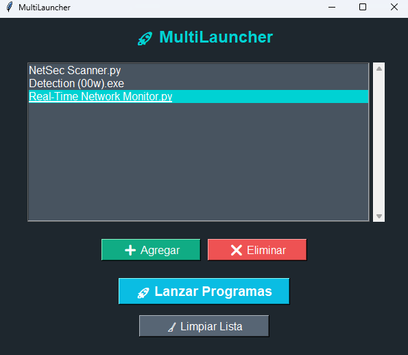

# 🚀 MultiLauncher  

**MultiLauncher** es una herramienta que te permite ejecutar múltiples programas con un solo clic, optimizando tu tiempo y mejorando la organización de tu flujo de trabajo. Con su interfaz moderna, puedes agregar, eliminar y guardar accesos directos para iniciar varias aplicaciones simultáneamente.  

## 📌 Características  
✅ **Interfaz moderna e intuitiva** 🎨  
✅ **Guarda accesos rápidos entre sesiones** 🔄  
✅ **Permite agregar y eliminar programas fácilmente** 📂  
✅ **Ejecuta múltiples programas con un solo clic** ⚡  
✅ **Opciones de limpieza y configuración** 🔧  

## 🛠 Requisitos  
🔹 **Python 3.x** (Descárgalo en [python.org](https://www.python.org/downloads/))  
🔹 **Tkinter** (incluido por defecto en Python)  

## 📥 Instalación  
1️⃣ **Clona este repositorio o descarga el archivo `multilauncher.py`**:  
   ```bash
   git clone https://github.com/MercuGmes/MultiLauncher.git
   cd MultiLauncher
   ```  
2️⃣ **Ejecuta el script con Python**:  
   ```bash
   python multilauncher.py
   ```  

## 🎮 Uso  
🔹 **Agregar programas:** Presiona el botón **"➕ Agregar"** y selecciona un archivo ejecutable.  
🔹 **Lanzar programas:** Pulsa **"🚀 Lanzar Programas"** para abrir todas las aplicaciones guardadas.  
🔹 **Eliminar accesos:** Selecciona un programa y presiona **"❌ Eliminar"** para removerlo de la lista.  
🔹 **Limpiar lista:** Usa **"🧹 Limpiar Lista"** para borrar todos los accesos guardados.  

## 🖼 Captura de Pantalla  
  

## ⚖️ Licencia  
Este proyecto está bajo la Licencia **MIT**. ¡Siéntete libre de contribuir y mejorar MultiLauncher! 😊  

---

### 👤 Autor  
💡 Creado por **MercuGmes** 🛠  

---

<p align="center">
  
</p>
